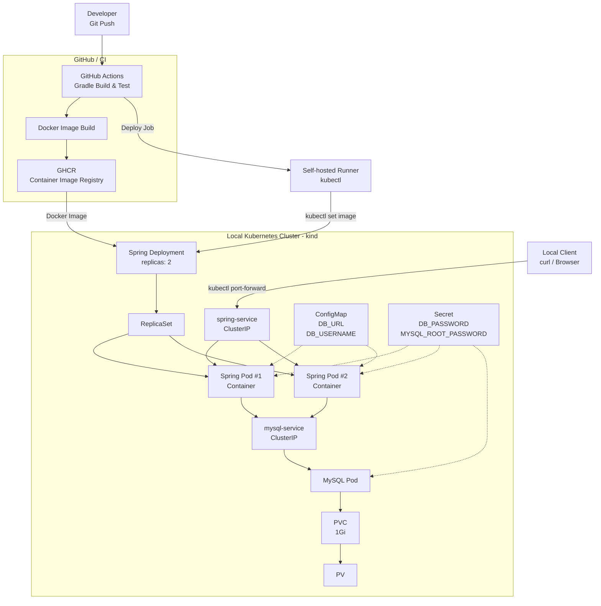

# Kubernetes Spring Boot Portfolio

Spring Boot 애플리케이션과 MySQL을 로컬 Kubernetes(kind) 환경에 배포하고,
GitHub Actions와 GHCR, Self-hosted Runner를 활용하여 CI/CD 자동 배포 파이프라인을 구축한 프로젝트입니다.

Kubernetes의 Deployment, Service, ConfigMap, Secret, Probe, PVC를 활용하여
애플리케이션 배포와 설정 관리, 데이터 영속성 및 장애 복구를 구성했습니다.
또한 Rolling Update 과정에서 발생한 Probe 문제를 로그와 이벤트를 통해 분석하고
Startup Probe를 적용하여 배포 장애를 해결했습니다.

## Architecture




### Architecture Overview

- Spring Boot 애플리케이션을 **2개의 Pod**로 구성했습니다.
- `spring-service`를 통해 Spring Pod에 안정적으로 접근하도록 구성했습니다.
- Spring 애플리케이션은 `mysql-service`를 통해 MySQL에 연결됩니다.
- 일반 DB 설정은 **ConfigMap**, 비밀번호는 **Secret**으로 분리했습니다.
- MySQL 데이터는 **PVC/PV**를 사용하여 Pod 재생성 후에도 유지되도록 구성했습니다.
- **Readiness/Liveness Probe**를 적용하여 Pod 상태 확인과 장애 복구를 실습했습니다.

## Kubernetes Resources

| Resource        | Configuration                        | Purpose                                            |
| --------------- | ------------------------------------ | -------------------------------------------------- |
| Deployment      | Spring Boot × 2, MySQL × 1           | Pod 배포 및 원하는 Replica 수 유지                 |
| Service         | `spring-service`, `mysql-service`    | Pod 간 안정적인 네트워크 연결 및 서비스 디스커버리 |
| ConfigMap       | `DB_URL`, `DB_USERNAME`              | 일반 DB 설정을 애플리케이션과 분리                 |
| Secret          | `DB_PASSWORD`, `MYSQL_ROOT_PASSWORD` | 민감한 DB 인증 정보 분리                           |
| PVC / PV        | 1Gi                                  | MySQL 데이터 영속성 확보                           |
| Readiness Probe | `/docker-test`                       | 트래픽을 받을 수 있는 Pod인지 확인                 |
| Liveness Probe  | `/docker-test`                       | 비정상 컨테이너 감지 및 재시작                     |
| Resources       | CPU / Memory Requests & Limits       | Pod의 자원 요청량과 최대 사용량 설정               |

## What I Tested

단순 배포에 그치지 않고 장애 상황을 직접 만들어 Kubernetes의 동작을 확인했습니다.

### Deployment Self-Healing

Spring Boot Pod와 MySQL Pod를 직접 삭제한 후 새로운 Pod가 자동으로 생성되는 것을 확인했습니다.

이를 통해 Deployment와 ReplicaSet이 설정된 replica 수를 유지하는 Self-Healing 동작을 확인했습니다.

### Service & EndpointSlice

Service의 Label Selector와 Pod Label의 불일치 상황을 직접 만들어 Endpoint가 정상적으로 연결되지 않는 것을 확인했습니다.

이후 Label을 수정하고 EndpointSlice를 확인하여 Service가 Ready 상태의 Pod를 대상으로 트래픽을 전달하는 구조를 확인했습니다.

### Readiness Probe

Readiness Probe의 Health Check 경로를 의도적으로 잘못 설정했습니다.

Pod가 Running 상태이더라도 Ready 상태가 아니면 Service의 트래픽 대상에서 제외되는 것을 EndpointSlice를 통해 확인했습니다.

### Liveness Probe

Liveness Probe의 Health Check 경로를 의도적으로 잘못 설정했습니다.

Probe 실패가 지속되면 컨테이너가 자동으로 재시작되고 `RESTARTS` 횟수가 증가하는 것을 확인했습니다.

### Persistent Storage

MySQL에 테스트 데이터를 저장한 후 MySQL Pod를 직접 삭제하여 새로운 Pod가 생성되도록 했습니다.

새로운 MySQL Pod에서도 기존 데이터가 유지되는 것을 확인하여 PVC/PV를 통한 데이터 영속성을 검증했습니다.

### ConfigMap & Secret

DB 접속 주소와 사용자명은 ConfigMap으로, 비밀번호는 Kubernetes Secret으로 분리했습니다.

Deployment에서는 `configMapKeyRef`와 `secretKeyRef`를 사용하여 설정값을 환경변수로 주입하도록 구성했습니다.

## Environment

| Technology  | Usage                                     |
| ----------- | ----------------------------------------- |
| Kubernetes  | 컨테이너 오케스트레이션 및 리소스 관리    |
| kind        | Docker 기반 로컬 Kubernetes 클러스터 구성 |
| kubectl     | Kubernetes 리소스 배포 및 상태 확인       |
| Docker      | Spring Boot 애플리케이션 이미지 빌드      |
| Spring Boot | REST API 애플리케이션                     |
| MySQL 8     | 애플리케이션 데이터베이스                 |
| Linux / WSL | Kubernetes 실습 및 명령어 실행 환경       |

## CI/CD

GitHub Actions를 이용하여 Spring Boot 애플리케이션의 CI/CD 파이프라인을 구성했습니다.

```text
Git Push
   ↓
GitHub Actions
   ↓
Gradle Build & Test
   ↓
Docker Image Build
   ↓
GHCR Push
   ↓
Self-hosted Runner
   ↓
Kubernetes Rolling Update
```
## Troubleshooting

| Problem                                            | Diagnosis                                                                         | Resolution                                                         |
| -------------------------------------------------- | --------------------------------------------------------------------------------- | ------------------------------------------------------------------ |
| Spring Pod가 Running이지만 Ready 상태가 되지 않음  | `kubectl describe pod`와 EndpointSlice를 확인하여 Readiness Probe 경로 오류 확인  | Health Check 경로를 `/docker-test`로 수정하여 정상 Ready 상태 복구 |
| Liveness Probe 실패로 컨테이너가 반복 재시작됨     | `kubectl get pods`에서 RESTARTS 증가 및 Probe 실패 확인                           | Liveness Probe 경로를 `/docker-test`로 수정하여 재시작 문제 해결   |
| Service가 Spring Pod와 연결되지 않음               | Service Selector와 Pod Label을 비교하고 EndpointSlice에서 Endpoint 연결 상태 확인 | Selector와 Label을 일치시켜 Service 연결 복구                      |
| MySQL Pod 재생성 과정에서 Spring DB 연결 경고 발생 | Spring 로그에서 Hikari DB Connection 관련 경고 확인                               | MySQL Pod 재생성 후 `mysql-service`를 통한 DB 연결 복구 확인       |
| CI/CD 배포 중 Kubernetes Rolling Update Timeout 발생 | `kubectl describe pod`와 이전 컨테이너 로그를 확인하여 Spring Boot 기동 전에 Liveness Probe가 실행되어 컨테이너가 재시작되는 원인 확인 | `startupProbe`를 추가하여 애플리케이션 기동 시간을 확보하고 재배포하여 정상 Rolling Update 확인 |

## Security

- DB 접속 정보 중 일반 설정값은 **ConfigMap**, 비밀번호는 **Kubernetes Secret**으로 분리했습니다.
- 실제 비밀번호가 포함된 `mysql-secret.yaml`은 `.gitignore`를 통해 Git 추적에서 제외했습니다.
- GitHub에는 실제 Secret 대신 `mysql-secret.example.yaml`을 제공하여 필요한 Secret 구조만 확인할 수 있도록 구성했습니다.

> Kubernetes Secret은 민감한 정보를 일반 설정과 분리하기 위해 사용했으며, 실제 운영 환경에서는 RBAC, 암호화 또는 외부 Secret 관리 도구 등 추가적인 보안 구성이 필요할 수 있습니다.
